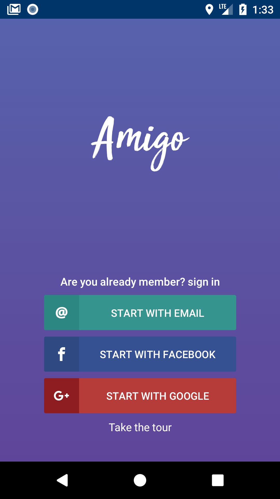
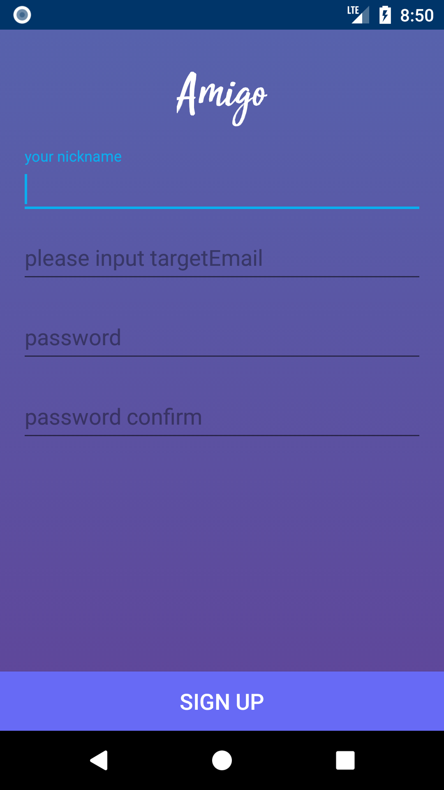
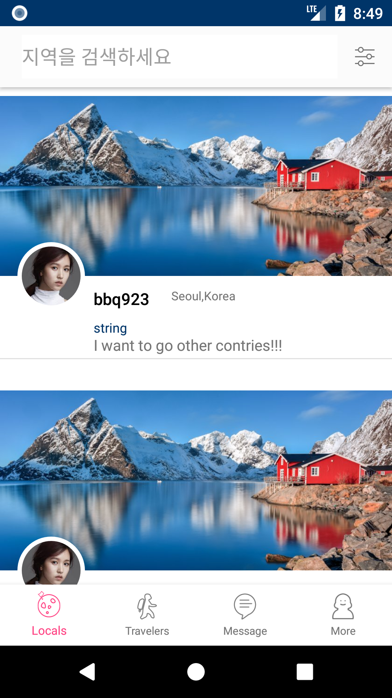

# Amigo android

### language
* Kotlin

### ScreenShots

### OpenSource 
* Firebase(database, analytics, FCM)
* CircleImageView
* AHBottomNavigation
* Retrofit2 (network)
* fresco (facebook imageview)
* OKHttp
* Timber(logging)

  
